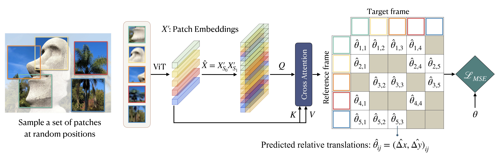
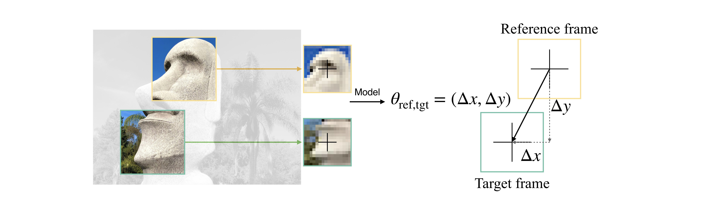

# How _PARTs_ assemble into wholes: Learning the relative composition of images
PyTorch implementation of the method PART in *How PARTs assemble into wholes: Learning the relative composition of images* paper.

## Idea
The composition of objects and their parts, along with object-object positional relationships, provides a rich source of information for representation learning. Existing works commonly start from a grid structure, where the goal of the pretext task involves predicting the absolute position index of patches within a fixed grid. We introduce PART, a self-supervised learning approach that leverages continuous relative transformations between off-grid patches to overcome these limitations. By modeling how parts relate to each other in a continuous space, PART learns the _relative composition of images_.


## Training
CIFAR100:
```bash
./yaml_files/config_parent_port.yaml
python3 parent_all_versions.py
```
ImageNet:
```bash
./yaml_files/config_parent_port_imagenet.yaml
python3 parent_all_versions_imagenet.py
```
cmd1 will make the command for running the pretraining phase.

cmd2 will make the command for running the finetuning phase.

You can change the param_grid command to do a parameter search for certain parameters in pretraining or finetuning phase.

cmd1 and cmd2 will run:

```bash
python3 main.py
```
## Implementation
This repo is based on [MP3](https://proceedings.mlr.press/v162/zhai22a/zhai22a.pdf) which is based on [DeiT](https://github.com/facebookresearch/deit).

The core implementation happens in make_dataset.py (including VectorizedCIFAR, VectorizedIMAGENET, and VisionTransformer classes), engine.py (including train_one_epoch(), evaluate() and evaluate_one_img() fuctions), viz_utils.py (including reconstruct_image_unfold_v2, recontruct_image_unfold_v4 and viz_img_bbs) and timm/models/vision_transformers.py.
