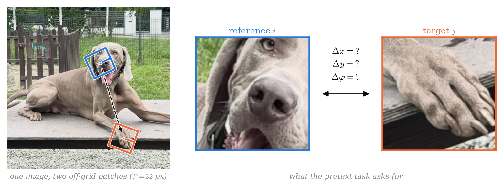

# RoPART

**Learning relative orientation in off-grid self-supervised vision.**



*The RoPART pretext task: sample two patches at random continuous positions and
orientations, then predict the relative transform `(Δx, Δy, Δφ)` that takes the
reference patch to the target. No absolute positions, no position embeddings — the
geometry is the supervision.*

RoPART (**Ro**tation + PART) extends [PART](https://github.com/Melika-Ayoughi/PART)'s
pairwise self-supervised pretext task from relative *translation* `(Δx, Δy)` between
off-grid image patches to planar *rigid motion* SE(2), by adding a relative
*orientation* target `Δφ`. The research question is whether supervising relative
orientation yields visual representations with better performance on
orientation-sensitive downstream tasks — without degrading classification.

This is an MSc Computing individual project at Imperial College London (Department
of Computing, 70081), running June–September 2026.

## Idea

PART learns the *relative composition* of images by sampling patches off-grid and
predicting the relative translation between random patch pairs — no absolute
positions, no position embeddings. Its authors extended the target with relative
scale as a proof of concept, and list "modelling rotations" as open future work.
RoPART takes that step: predicting relative orientation between patch pairs, so the
pretext task spans translation **and** rotation. The contribution is methodological
— completing the relative pretext task towards the rigid-motion group — rather than
chasing benchmark numbers.

## Results

The model is built up one geometric channel-group at a time — a translation-only
baseline `(Δx, Δy)` first, then RoPART's rotation `(cos Δφ, sin Δφ)`, with relative
scale left as an optional final step — so that any downstream effect is attributable
to a single added factor. Pretraining is ViT-B/16 on ImageNet-100; downstream is
ImageNet-100 classification plus the HLW horizon-line task, all end-to-end finetunes
against the translation-only baseline.

Established (each rests on a significant paired measurement, or on agreement across
independent measurements):

- **Relative orientation is learnable** under the RoPART pretext at patch size
  `P=32` with bounded `±30°` rotation. The deconfounded arm matches the raw one, so
  the interpolation signature is ruled out as the source of the signal.
- **It is not learnable at small patches.** `P=4`, `8` and `16` all come back null —
  a small patch does not carry recoverable orientation.
- **Supervising rotation costs nothing**, neither translation at the pretext level
  nor classification on ImageNet-100.
- **Rotating pixels *without* supervising them damages the representation** on both
  downstream tasks. As plain augmentation, rotation hurts.
- **Pretext structural gates poorly predict downstream utility** — a wider rotation
  range degrades the intrinsic gates without a matching downstream cost.
- Side result: **HLW's published AUC is structurally dominated by `ρ`** (≈28×) and is
  effectively blind to the orientation effect, so `θ` MAE is the honest headline.

Suggested, not established:

- RoPART `±30°` beats the baseline on HLW `θ` by **3.2%**, with the pre-registered
  specificity control firing (`p_θ = 0.027` against `p_ρ = 0.93`) — i.e. the gain sits
  in the orientation channel, not the translation-like one. It rests on a **single
  seed**, its bootstrap CI grazes zero, and it does not survive Bonferroni against the
  other arms. The ordering is identical across measurements, which is what makes it
  worth reporting; a seed replication is what would settle it.

The full write-up, including the statistical protocol and the threats to validity, is
in `latex/final_report/`.

## Repository layout

```
README.md          # this file
PART/              # upstream PART reference implementation (vendored)
RoPART/            # RoPART extensions, evaluation, and probes
latex/             # interim & final report (.tex, compiled .pdf) + references.bib
```

## Getting started

The upstream PART code is vendored under `PART/`, so there is nothing extra to
clone. RoPART runs on a modern stack (the upstream pins are outdated and ignored):

```bash
cd RoPART
python3.12 -m venv .venv && source .venv/bin/activate
pip install -r requirements.txt
```

Local development and short runs use the Apple-Silicon **MPS** backend; full-scale
pretraining runs on **CUDA** via the Imperial DoC SLURM cluster. The same command
works on both — pass `--device mps` or `--device cuda`. A short CIFAR-100 pretraining
run (data downloads on first use):

```bash
cd RoPART
WANDB_MODE=offline PYTORCH_ENABLE_MPS_FALLBACK=1 python -m ropart.train \
  --model deit_small_patch4_32 --data-set CIFAR --epochs 1 --device mps
```

Add `--control raw --rotation-set continuous` for the RoPART rotation pretext; the
default is the translation-only baseline. `ropart/scripts/` holds the launchers for
the pretraining, finetuning and scoring runs, and `ropart/scripts/cluster/` the SLURM
scripts. Tests: `python -m pytest tests -q`.

## Built on

Ayoughi M, Abnar S, Huang C, Sandino C, Lala S, Dhekane EG, et al. *How PARTs
assemble into wholes: Learning the relative composition of images.* NLDL 2026
(PMLR 307). arXiv:2506.03682.

Full bibliography in `latex/final_report/references.bib`.
